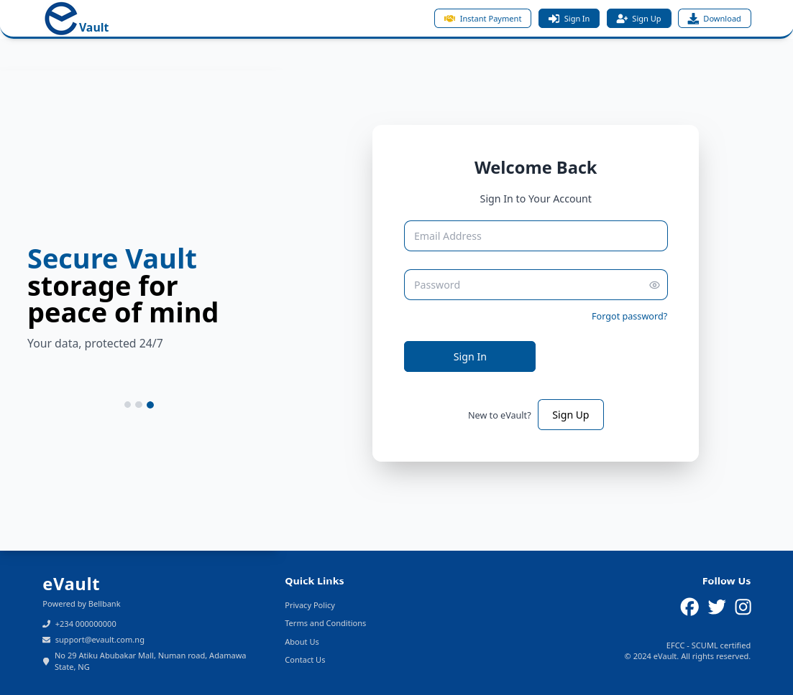
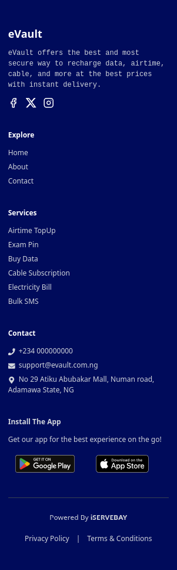

# evault-frontend

This is a React-based web application built with npm. Tailwind CSS is used for styling, and the code is written in JSX for easier modification.

## Screenshots:

### - Desktop 


### - Mobile



## Project Recreation Steps

1. **Create a new React project:**
   ```bash
   npx create-react-app evault-frontend
   cd evault-frontend
   ```

2. **Install required dependencies:**
   ```bash
   npm install tailwindcss postcss autoprefixer
   npm install react-router-dom
   npm install @heroicons/react
   ```

3. **Initialize Tailwind CSS:**
   ```bash
   npx tailwindcss init -p
   ```

4. **Project Structure:**
   ```
   src/
   ├── components/
   │   ├── assets/
   │   ├── layout/
   │   └── pages/
   ├── App.jsx
   └── index.js
   ```

## Project Setup

To set up the project locally, follow these steps:

1. **Clone the repository:**
   ```bash
   git clone https://github.com/your-username/evault-webpage.git
   cd evault-webpage
   ```

2. **Install dependencies:**
   Make sure you have Node.js and npm installed on your machine. Then, run:
   ```bash
   npm install
   ```

3. **Start the development server:**
   ```bash
   npm run dev
   ```
   This will start the development server and open the application in your default browser.

## Available Scripts

In the project directory, you can run:

- `npm start`: Runs the app in development mode at [http://localhost:3000](http://localhost:3000)
- `npm test`: Launches the test runner
- `npm run build`: Builds the app for production
- `npm run eject`: Ejects the create-react-app configuration

## Contact

For any queries or suggestions, feel free to reach out:

- GitHub: [your-github-username]
- Email: [your-email@example.com]
- LinkedIn: [your-linkedin-profile]

## License

This project is open source and available under the MIT License.