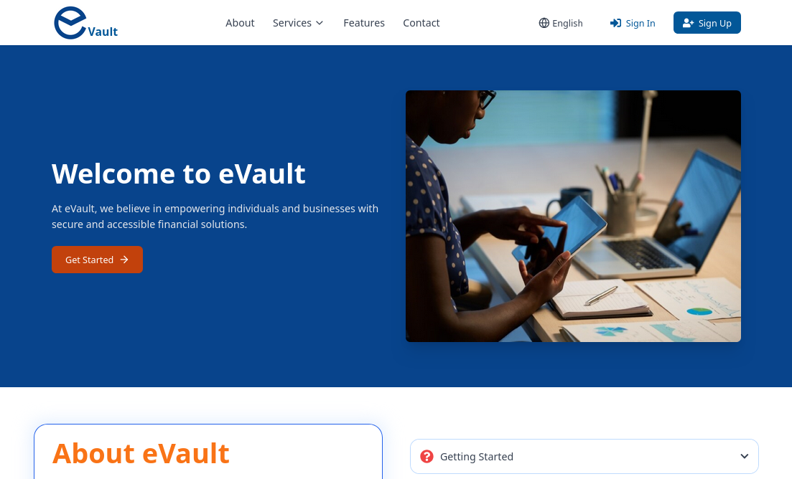

# eVault - Secure Digital Financial Management


## Screenshots:



## Table of Contents
- [Introduction](#introduction)
- [Features](#features)
- [Getting Started](#getting-started)
- [Usage](#usage)
- [Security](#security)
- [Support](#support)
- [Developers](#developers)
- [License](#license)

## Introduction

eVault is a cutting-edge digital financial management platform designed to empower individuals and businesses with secure, accessible, and innovative financial solutions. Our mission is to bridge the gap in financial management and create an inclusive ecosystem that enables everyone to participate in the modern economy.

## Features

- **Bank-Grade Security**: Military-grade encryption and multi-layer security protocols to protect your financial data.
- **24/7 Access**: Manage your finances anytime, anywhere with real-time transactions and instant updates.
- **Smart Digital Vault**: Securely store and manage sensitive credentials, documents, and important files.
- **Multi-language Support**: Available in English, Hausa, Igbo, and Yoruba to serve a diverse user base.
- **Inclusive Financial Access**: Tailored solutions for individuals and businesses, regardless of location or background.
- **Expert Support**: Round-the-clock dedicated support team to assist with queries and concerns.

## Getting Started

### Prerequisites
- Node.js (v18.0.0 or later)
- npm (v8.0.0 or later)
- Supabase account

### Setup Instructions

1. **Clone the repository:**
   ```bash
   git clone <repository-url>
   cd evault
   ```

2. **Install dependencies:**
   ```bash
   npm install
   ```

3. **Set up Supabase:**
   - Create a new project at [https://supabase.com](https://supabase.com)
   - Copy your project URL and anon key
   - Update the `.env` file with your Supabase credentials:
     ```
     VITE_SUPABASE_URL=your_supabase_project_url
     VITE_SUPABASE_ANON_KEY=your_supabase_anon_key
     ```

4. **Run database migrations:**
   - In your Supabase dashboard, go to the SQL Editor
   - Run the migration files in order:
     - `supabase/migrations/create_user_profiles.sql`
     - `supabase/migrations/create_accounts_table.sql`
     - `supabase/migrations/create_transactions_table.sql`

5. **Configure Supabase Authentication:**
   - In your Supabase dashboard, go to Authentication > Settings
   - Disable "Enable email confirmations" for development (optional)
   - Configure your site URL and redirect URLs as needed

6. **Start the development server:**
   ```bash
   npm run dev
   ```

7. **Test the application:**
   - Navigate to the signup page
   - Create a new account (Personal or Business)
   - Sign in with your credentials
   - Access the dashboard

## Usage

After logging in, you can:

- Upload and manage documents in your digital vault
- Perform financial transactions
- Monitor your account activities in real-time
- Customize your security settings
- Access customer support

For detailed instructions, please refer to our webpage [eVault](https://www.evault.com.ng).

## Security

At eVault, your security is our top priority. We employ:

- End-to-end encryption for all data transmissions
- Multi-factor authentication
- Regular security audits and penetration testing
- Compliance with international financial security standards

For more information, visit our webpage [eVault](https://www.evault.com.ng).

## Support

If you need assistance, our support team is available 24/7:

- Email: support@evault.com.ng
- Phone: +234 (0) 123 456 7890
- Live Chat: Available on our website


## Developers


### Prerequisites
- Node.js (v14.0.0 or later)
- npm (v6.0.0 or later)

### Setting up the development environment

1. Clone the repository:
   ```
   git clone <repo name>
   cd evault
   ```

2. Install dependencies:
   ```
   npm install
   ```

3. Set up environment variables:
   - Copy `.env.example` to `.env`
   - Fill in the required environment variables

4. Start the development server:
   ```
   npm start
   ```

5. Open your browser and visit `http://localhost:3000`

### Building for production

To create a production build, run:
```
npm run build
```

### Tailwind CSS

This project uses Tailwind CSS for styling. The configuration file is located at `tailwind.config.js`. To compile Tailwind CSS:

1. Run the build process:
   ```
   npm run build:css
   ```

2. For development with hot reloading:
   ```
   npm run watch:css
   ```

### Testing

Run the test suite with:
```
npm test
```

### Contributing

1. Fork the repository
2. Create your feature branch (`git checkout -b feature/AmazingFeature`)
3. Commit your changes (`git commit -m 'Add some AmazingFeature'`)
4. Push to the branch (`git push origin feature/AmazingFeature`)
5. Open a Pull Request

Please ensure your code adheres to our coding standards and includes appropriate tests.


## License

eVault is proprietary software. All rights reserved. Unauthorized copying, modification, distribution, or use of this software is strictly prohibited.

© 2024 eVault Technologies Ltd.